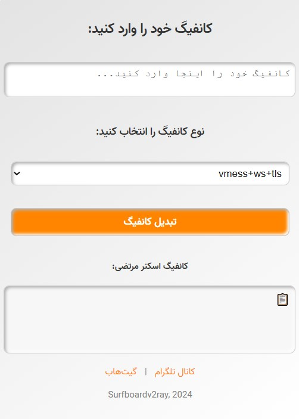

<h1 align="center">
CFScanner-CCG
</h1>

<h2 align="center">
ساخت کانفیگ سفارشی برای اسکنر آیپی کلادفلیر
<h2/>

## مقدمه
🟢 با استفاده از این ابزار میتونید کانفیگ custom برای نسخه ویندوز [اسکنر آیپی کلادفلیر](https://github.com/MortezaBashsiz/CFScanner) نوشته شده توسط مرتضی باشسیز بسازید.

## راهنمای استفاده
🟡 [ویدیو آموزشی یوتوب از V2rayirani](https://youtu.be/JIjXFrWCfcY)

🟡 وارد [این صفحه](https://Surfboardv2ray.github.io/CFScanner-CCG) بشید.

🟡 کانفیگ‌های پشتیبانی شده از نوع vmess+ws+tls و vless+ws+tls و trojan+ws+tls هستند؛ یک گزینه رو انتخاب و کانفیگ خود را وارد کنید.

🟡 تبدیل کانفیگ رو بزنید، کانفیگ ساخته شده رو با فرمت json ذخیره کنید.

🟡 در اسکنر مرتضی نسخه ویندوز، از بخش منو Tools گزینه Add custom v2ray config رو بزنید و کانفیگ json سیو شده رو انتخاب کنید.

  

